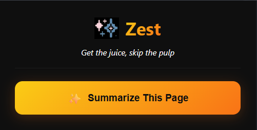
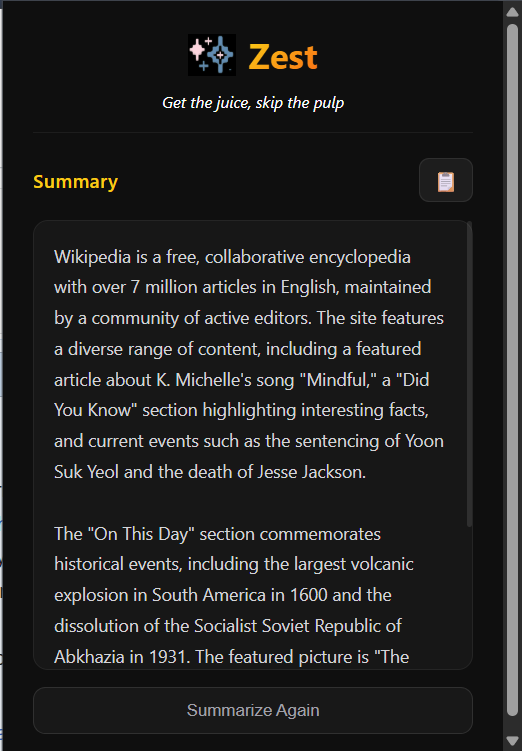

# Project Name
ZEST - AI Web Page Summarizer
## About
ZEST is a chrome extension that summarizes web pages using the gemini API.
## Features
- One Click web page summary
- Fast Response
- Clean UI
## Tech Stack
- HTML
- CSS
- JavaScript
- Chrome Extension
- Gemini API
## Installation
1. Clone the repository
2. Open Chrome
3. Go to chrome://extensions/
4. Enable Developer Mode
5. Click "Load Unpacked"
6. Select the project folder
## Usage
1. Open any webpage
2. Click the ZEST extension
3. Click "Summarize"
4. View the AI summary
## Screenshots
### Popup

### Summary Output

